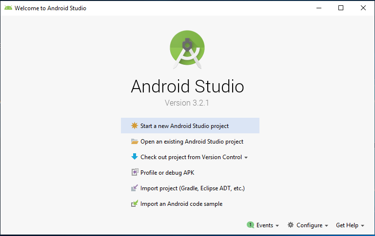
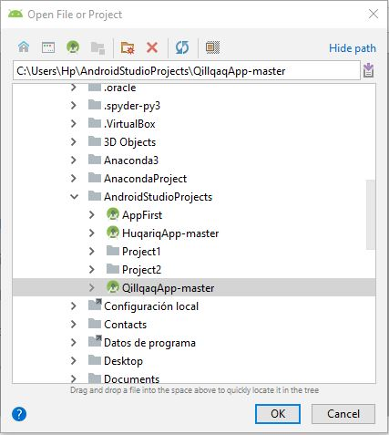
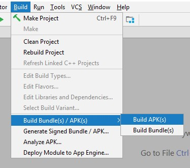
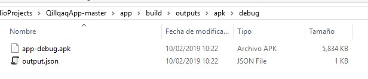
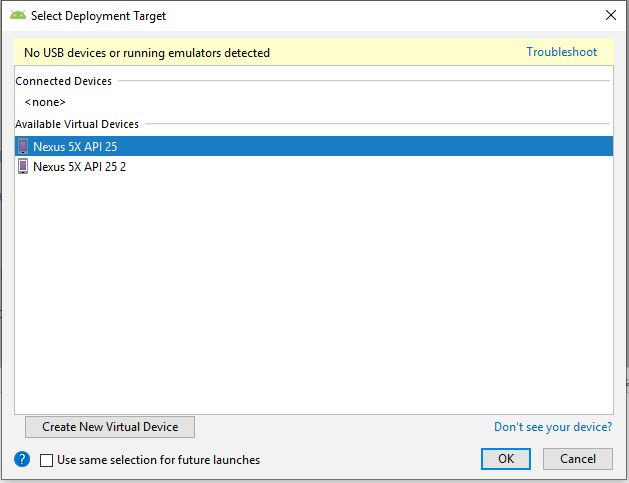
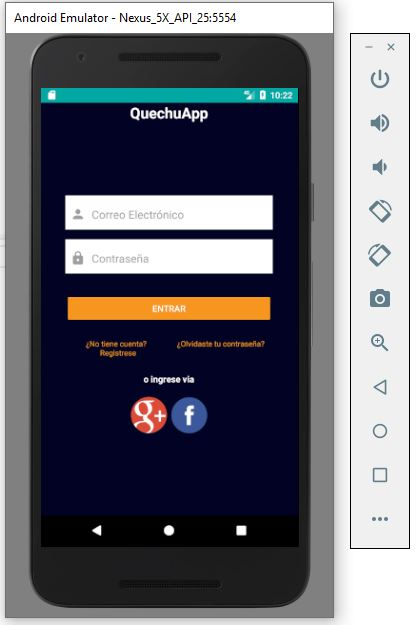

# QillqaqApp

QillqaqApp is an open source translator app for Android featuring a full online mode, voice input (ASR) and output (Text).

* [Overview](#overview)
* [Test the Sample](#test-the-sample)
* [Limitations](#limitations)

# Overview

This repository shows you how to create a translator app which uses the QillqaqServer service via its RESTful API. The app is created using Android Studio.

> *Supported mobile platforms:* Android
> *Developed with:* Windows Phone SDK 8.1, Apache Cordova 4.0.0, jQuery Mobile 1.4.5, jQuery 2.2.0

[Back to Top](#top)

# Test the code

Apart from exploring the code base in GitHub, you can also clone and build apk test.

[Back to Top](#top)

### Clone the sample

*  Click the button at the top of this document.
*  Provide your login credentials, if prompted.

### Android Studio

(These instructions were tested with Android Studio version 2.2.2, 2.2.3, 2.3, and 2.3.2)

1. Para poder probar la aplicación primero debes de abrir Android Studio y dirigirte a la opción "import project (Gradle, EclipseADT, etc.)".

2. Se abrirá una ventana, y nos vamos a dirigir a la ruta en la cual se encuentra el proyecto "HuqariqApp-master", luego seleccionaremos el archivo "build.gradle".

3. Hacemos Click en 'OK' y se abrirá el proyecto en Android Studio.

#### Exportar APK

1. Si estamos situados en Android Studio con la aplicación abierta y queremos exportar el APK, lo que haremos es lo siguiente: Build > Build Bundle(s)/APK(s) > Build APK(s).

4. Para finalizar, tan solo tendremos que ir a la carpeta en la que se encuentra nuestro proyecto. Ej. '..\QillqaqApp-master\app\build\outputs\apk\debug\app-debug.apk'. Lo vemos en la siguiente imagen, aunque recuerda que la ruta puedes cambiarla:

#### Instalar aplicacion en un emulador Android

1. Primero debes dirigirte a: Run > Run 'app'.
2. Se nos abrirá una ventana llamada "Select Deployment Target", esta ventana nos mostrara si tenemos algún "Available virtual devices".
3. Seleccionamos un dispositivo viral disponible,en caso contrario hacemos clic en "create New virtual Divice" y lo creamos según la capacidad de nuestra PC.

4. Para finalizar se abrirá un Android Emulador y se instalará la aplicación automáticamente.

### Gradle (command line)

*  Build the APK: ./gradlew build

# Limitations

[Android > 4.0] Tested on Android 4 and up because many APIs are now deprecated.

[Back to Top](#top)
